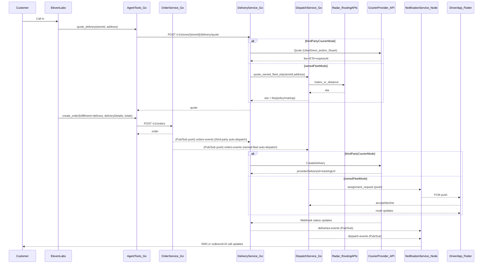

# Delivery + Dispatch: third-party couriers (Uber Direct + Stuart) + restaurant-owned fleet (Radar default)

## Goal

Add **delivery** as a first-class fulfillment mode for voice orders with two execution modes:

- **Third-party courier**: multi-carrier (**Uber Direct + Stuart**) with optional auto-routing (shortest ETA / lowest cost / balanced).
- **Restaurant-owned fleet**: a **real dispatch system** based on driver **availability + background location** (via a **driver app**), with **auto-assignment** and **multi-stop routes**.

For owned-fleet:

- **Radar is the default** routing/ETA engine (matrix + route optimization).
- **Google is used only** to generate “open in Google Maps/Waze” navigation links (no Google routing APIs).

Customers get delivery lifecycle updates via SMS/outbound call, and staff can monitor/override from the business app.

## Scope (v1)

- **Voice agent**: capture delivery address + instructions, quote **fee + ETA**, confirm, create delivery order.
- **Fleet models**:
  - **Third-party courier API**: Uber Direct + Stuart.
  - **Restaurant-owned fleet**: drivers use a **separate driver app** (Flutter) with **background GPS**, receive assignments, and update per-stop statuses.
- **Providers**: **Uber Direct** and **Stuart** (for third-party mode).
- **Routing** (third-party mode): store can either **pick a single provider** or enable **auto-selection per order** (e.g. shortest ETA). No implicit fallback unless explicitly enabled.
- **Fee payer**: configurable per store (customer pays vs store pays) + markup rules.
- **Ops**: dispatch (manual or auto), courier status tracking, tracking link/map, customer notifications.
- **Navigation links**: one-tap open in Google Maps/Waze for pickup and dropoff (generated server-side).
- **Owned fleet dispatching**: auto-assign based on driver availability + location; driver can carry multiple deliveries in a route.

## Architecture

## Data model

### A) Order additions (Order Service)

Add fulfillment + delivery fields (default is pickup, so no backfill needed):

- `fulfillmentType`: `pickup` | `delivery`
- `delivery` (optional):
  - `dropoffAddress` (structured fields)
  - `dropoffLatLng` (optional): `{lat: number, lng: number}` (for better routing/linking; can be computed)
  - `instructions`
  - `contactPhone` (usually `callerId`)
  - `fleetMode`: `third_party` | `owned_fleet`
  - `provider`: `uber_direct` | `stuart` (third-party only; selected provider for this order)
  - `assignedDriverId`: string? (owned-fleet only)
  - `assignedRouteId`: string? (owned-fleet only; route grouping)
  - `quote`: `providerFeeCents`, `currency`, `dropoffEtaMinutes`, `quoteExpiresAt`, `providerQuoteId` (if provider returns one)
  - `customerPaysDeliveryFee`: bool
  - `deliveryFeeCentsChargedToCustomer`: int (0 if store pays)
  - `providerDeliveryId`, `trackingUrl`
  - `deliveryStatusSummary`: `not_dispatched|dispatched|courier_assigned|picked_up|out_for_delivery|delivered|cancelled|failed`

Pricing: keep explicit fields (avoid overloading generic `FeeCents`). Prefer adding `DeliveryFeeCents` (charged-to-customer) so totals are unambiguous.

### B) Delivery documents (Delivery Service)

- `stores/{storeId}/deliveries/{deliveryId}`
  - `orderId`
  - `fleetMode`: `third_party` | `owned_fleet`
  - `provider`, `providerDeliveryId` (third-party)
  - `assignedDriverId` (owned-fleet)
  - `driverJobTokenId` (owned-fleet) (token record id; the token itself is never stored in plaintext)
  - `routeId` (owned-fleet) (duplicate of assignedRouteId for convenient querying)
  - `status` + history
  - `trackingUrl`
  - `quote` snapshot
  - `pickup` (store)
  - `dropoff` (customer)
  - `dropoffLatLng` (optional)
  - timestamps

### C) Drivers (restaurant-owned fleet)

- `stores/{storeId}/drivers/{driverId}`
  - `displayName` (optional)
  - `phoneE164` (required; used for Firebase phone auth)
  - `firebaseUid` (required once onboarded)
  - `active` (bool)
  - `capacity.maxActiveStops` (default e.g. 3)
  - `createdAt`, `updatedAt`

### D) Routes (restaurant-owned fleet)

Group multiple deliveries into a single driver run.\n

- `stores/{storeId}/driver_routes/{routeId}`
  - `driverId`
  - `deliveryIds`: string[]
  - `stopOrder`: string[] (ordered list of deliveryIds; may differ from creation order)
  - `status`: `planned|in_progress|completed|cancelled`
  - `planning`:
    - `optimizeStops`: bool
    - `timeWindowsEnabled`: bool
  - `createdAt`, `updatedAt`, `startedAt`, `completedAt`

### E) Driver shifts + locations (restaurant-owned fleet)

To support true dispatching we track driver availability and background location:\n

- `stores/{storeId}/driver_shifts/{shiftId}`
  - `driverId`
  - `status`: `on_shift|paused|off_shift`
  - `startedAt`, `endedAt`, `lastHeartbeatAt`

- `stores/{storeId}/driver_locations/{driverId}`
  - `lat`, `lng`, `accuracyM`, `recordedAt`, `expiresAt`

### F) Store settings

Under `stores/{storeId}`:

- `delivery_settings`:
  - `enabled`: bool
  - `fleet_mode`: `third_party` | `owned_fleet` | `hybrid` (default `third_party`)
  - `owned_fleet_quote_policy` (owned-fleet only):
    - `default_fee_cents`: number
    - `currency`: string (e.g. `USD`)
  - `owned_fleet_dispatch` (owned-fleet only):
    - `dispatch_trigger_status`: `confirmed|ready` (default `confirmed`)
    - `assignment_timeout_seconds`: number (default e.g. 20)
    - `max_active_stops_per_driver`: number (default e.g. 3)
    - `routing_provider`: `radar` (default `radar`)
  - `provider_selection_mode`: `single` | `auto`
  - `primary_provider`: `uber_direct` | `stuart` (used when mode=`single`, and as a tie-breaker when mode=`auto`)
  - `enabled_providers`: `["uber_direct","stuart"]` (used when mode=`auto`)
  - `routing_policy` (mode=`auto` only):
    - `optimize_for`: `eta` | `cost` | `balanced`
    - `max_eta_minutes`: number? (optional hard filter)
    - `max_provider_fee_cents`: number? (optional hard filter)
    - `max_quote_latency_ms`: number (default e.g. 2500) (controls parallel quote timeout)
  - `fee_payer_mode`: `customer` | `store` | `configurable`
  - `customer_fee_policy`: markup rules (none/fixed/percent + min/max)
  - `dispatch_mode`: `manual` | `auto_on_confirmed` | `auto_on_ready`
  - `service_area` (optional later)
  - `provider_fallback_enabled`: bool (default false) + `fallback_provider` (optional; only if you explicitly want this)

### D) Provider routing algorithm (delivery-service)

When `provider_selection_mode=auto`, `delivery-service` selects a provider per order/quote:\n

- **Parallel quote** all `enabled_providers` with a strict timeout (`max_quote_latency_ms`).\n
- **Filter** out providers that fail, exceed constraints (`max_eta_minutes`, `max_provider_fee_cents`), or return incomplete data.\n
- **Rank**:\n
  - `eta`: lowest ETA wins\n
  - `cost`: lowest provider fee wins\n
  - `balanced`: minimize a weighted score like: \(score = etaMinutes + (providerFeeCents / 100)\) (exact weights configurable later)\n
- **Tie-breaker**: prefer `primary_provider`, then deterministic sort by provider ID.\n

Voice UX note: even if multiple providers are quoted, the agent should present **only the selected best fee+ETA** (not a menu of providers), unless staff explicitly asks.\n

### F) Owned-fleet dispatch model (dispatch-service)

When `fleet_mode` is `owned_fleet` (or `hybrid` and staff selects owned-fleet for an order):\n

- **Drivers go on shift** in the driver app; the app provides **background location** updates.\n
- **Auto-assign**: dispatch-service selects the best driver based on availability + capacity + Radar ETAs.\n
- **Handshake**: driver must accept/decline within `assignment_timeout_seconds`; on timeout/decline we reassign.\n
- **Routes**: a driver can carry multiple deliveries; dispatch-service maintains `driver_routes` with an optimized stop order.\n

Owned-fleet ETA/routing uses **Radar**:\n

- Matrix: driver→store ETAs to rank candidates.\n
- Route optimization: multi-stop sequencing and route updates.\n

### G) Phase 2: Arrival detection (Radar Trips-per-leg)

Later, to reduce manual tapping and improve accuracy, use **Radar Trips-per-leg**:\n

- Each active route leg is modeled as a **Trip** (current origin→destination).\n
- When the leg changes (pickup→stop1, stop1→stop2, etc.), dispatch-service starts the next Trip.\n
- Trip events drive safe automation (with guardrails):\n
  - Arrived pickup/dropoff can auto-suggest status changes.\n
  - “Delivered” should still require explicit driver confirmation by default.\n

Optional safety net: keep a small **store geofence** for “arrived pickup” confirmation.\n

### H) “Open in Maps/Waze” links (business app + driver app)

For any pickup/dropoff address we expose:\n

- **Google Maps** (preferred for multi-stop routes): use a `maps.google.com` directions link with origin/destination/waypoints when we have lat/lng; otherwise use address strings.\n
- **Waze**: open a single stop via `waze.com/ul` (Waze is not great for multi-stop). For routes, show a “Next stop in Waze” button per stop.\n

We will generate these links server-side (delivery-service) so both the Flutter business app and driver app can rely on the same safe encoding.\n

## Backend changes

### 1) `delivery-service` (Go): third-party couriers + quote orchestration + maps links

Create `backend/services/delivery-service/` using a modular layout (no mega-file):

- `cmd/delivery-service/main.go` (routing + wiring only)
- `internal/providers/provider.go` (interface + shared types)
- `internal/providers/uber_direct/client.go`
- `internal/providers/stuart/client.go`
- `internal/maps/links.go` (generate Google Maps / Waze URLs; optional geocoding helpers)
- `internal/api/handlers_quote.go`
- `internal/api/handlers_dispatch.go`
- `internal/api/handlers_webhooks.go`
- `internal/delivery/repo.go` (Firestore)
- `internal/events/publisher.go` (deliveries-events)

Core endpoints:

- `POST /v1/stores/{storeId}/delivery/quote`\n
  - If `provider_selection_mode=single`, quote the `primary_provider`.\n
  - If `provider_selection_mode=auto`, quote `enabled_providers` in parallel and return the **selected** provider quote.\n
  - Optional response fields (for staff/debug): `consideredProviders[]` with per-provider fee/eta/error.
- `POST /v1/orders/{orderId}/delivery/dispatch` (idempotent by orderId)
- `POST /v1/orders/{orderId}/delivery/cancel`
- `POST /tasks/orders-events` (Pub/Sub push for auto-dispatch logic)
- `POST /tasks/providers/uber_direct/webhook` (signature verify + mapping)
- `POST /tasks/providers/stuart/webhook` (signature verify + mapping)

### 1b) `dispatch-service` (Go): owned-fleet drivers + shifts + background location + auto-assign + routes

Create `backend/services/dispatch-service/` (new) with a modular layout:\n

- `cmd/dispatch-service/main.go`\n
- `internal/drivers/repo.go` (drivers CRUD)\n
- `internal/shifts/repo.go`\n
- `internal/locations/repo.go`\n
- `internal/assign/engine.go` (candidate filtering + scoring + TTL handshake)\n
- `internal/routes/route_planner.go` (Radar optimization + stop insertion)\n
- `internal/radar/client.go` (Radar distance/matrix/optimize)\n
- `internal/api/handlers_driver_app.go` (shift/location/accept/decline)\n
- `internal/api/handlers_business_ops.go` (ops dashboards)\n
- `internal/events/publisher.go` (`dispatch-events`)\n
- `internal/tasks/orders_events.go` (Pub/Sub push)\n

### 2) Order Service

In [backend/services/order-service/cmd/order-service/main.go](backend/services/order-service/cmd/order-service/main.go):

- Extend `POST /v1/orders` to accept `fulfillmentType=delivery` + `delivery` object.
- Persist and return the delivery fields.
- Include fulfillment + delivery summary in `orders-events`.

### 3) Notification Service

In `backend/services/notification-service/src/index.ts`:

- Consume `deliveries-events` and notify customer on key transitions:
  - `courier_assigned`, `out_for_delivery`, `delivered`, `failed/cancelled`, `delay` (if provider signals)

Keep delivery templates **separate** from kitchen status templates to avoid confusion.

Driver SMS: delivery-service should not own SMS plumbing.\n

- delivery-service emits a `deliveries-events` message with `recipientRole=driver` and an SMS body + link.\n
- notification-service sends the SMS via Twilio (same infra), using store settings for sender number where applicable.\n

For owned-fleet, assignment requests and route updates should be **push notifications** (FCM) to the driver app (not SMS).\n

## Agent-tools + voice agent

- Add tools:
  - `quote_delivery(storeId, address, instructions?)`
  - `create_order` extended to include `fulfillmentType` + `delivery` snapshot
  - Optional: `get_delivery_status(orderId)`
- Update ElevenLabs guidance:
  - Must collect required address fields and confirm (read back)
  - If **customer pays**, must confirm fee + ETA before creating order
  - If quote expires, agent re-quotes

## Business app

- Store settings:\n
  - enable delivery\n
  - `fleet_mode` (third-party / owned-fleet / hybrid)\n
  - third-party: provider + routing + dispatch mode\n
  - owned-fleet: dispatch settings + driver management\n
- Orders list: show a “Delivery” badge + `deliveryStatusSummary`.
- Order detail: delivery panel with address/instructions, quote info, status, tracking link; dispatch/cancel actions.
- Add `/deliveries` route for active deliveries (ops board).

Owned-fleet UI additions:\n

- Add `/drivers` route to manage drivers (name + phone + active).\n
- Add a dispatch dashboard: who is on shift, pending assignments, active routes.\n
- In order detail, show assignment (driver + route) and allow override.\n
- Add “Open in Maps/Waze” buttons for pickup/dropoff and for route legs.\n

## Infrastructure (Terraform/GCP)

- Cloud Run v2 `delivery-service` + `dispatch-service` + service accounts.
- Pub/Sub:
  - `deliveries-events` topic
  - push subscription → notification-service `/events/deliveries`
  - subscription from existing `orders-events` → delivery-service `/tasks/orders-events` (third-party)
  - subscription from existing `orders-events` → dispatch-service `/tasks/orders-events` (owned-fleet)
- Secret Manager:
  - Uber Direct creds + webhook secret
  - Stuart creds + webhook secret
  - Radar API key (routing/ETAs/optimization for owned-fleet)

## Acceptance criteria

- Store can choose **Uber Direct or Stuart** (single) **or enable auto-selection** (ETA/cost/balanced) and delivery works end-to-end (quote → order → dispatch → status tracking).
- Store can enable **restaurant-owned fleet** and:\n
  - manage drivers\n
  - drivers go on shift in a driver app and share background location\n
  - auto-assign works (accept/decline/timeout/reassign)\n
  - drivers can handle multi-stop routes\n
  - customer receives delivery lifecycle notifications\n
- Delivery dispatch is idempotent (no duplicate courier jobs).
- Webhooks are validated (signature/secret) and mapped to stable internal statuses.
- Customer notifications are sent per store settings/templates.

## Implementation todos

- `delivery-schema`: Define fulfillment + delivery schemas (order fields, delivery docs, store delivery_settings) and delivery lifecycle events.
- `delivery-provider-interface`: Implement `CourierProvider` interface and shared quote/dispatch models.
- `delivery-provider-uber`: Implement Uber Direct adapter (quote/dispatch/cancel/webhook mapping).
- `delivery-provider-stuart`: Implement Stuart adapter (quote/dispatch/cancel/webhook mapping).
- `delivery-routing`: Implement auto-routing in delivery-service (parallel quotes + constraints + ranking + deterministic tie-break).
- `dispatch-service-owned-fleet`: Create dispatch-service (drivers/shifts/locations/routes) with Radar routing client; implement auto-assign + reassignment timers.
- `driver-app`: Create a separate Flutter driver app with phone auth, background location, push assignment accept/decline, route UI, per-stop status buttons.
- `maps-links`: Generate safe Google Maps + Waze navigation links for pickup/dropoff and route legs; expose them to business UI + driver app.
- `phase2-arrival-detection`: Later: implement Radar Trips-per-leg arrival detection with guardrails (never auto-deliver by GPS by default).
- `delivery-service-core`: Implement delivery-service endpoints + Firestore persistence + deliveries-events publishing.
- `order-service-delivery`: Extend order-service create/update/events for delivery fields.
- `agent-tools-delivery`: Add agent-tools delivery tools + ElevenLabs configs/guidance updates.
- `notification-delivery`: Notification-service consumes deliveries-events and sends comms.
- `business-delivery-ui`: Business app settings + orders UI + deliveries route + dispatch dashboard + driver management.
- `terraform-delivery`: Deploy delivery-service + dispatch-service + Pub/Sub + secrets + IAM.