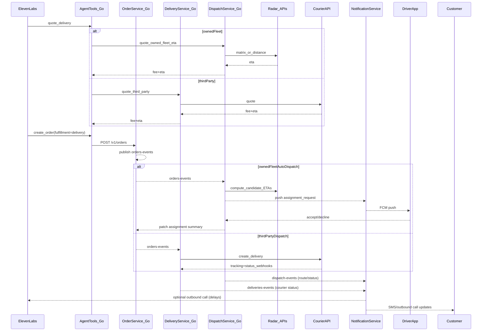

# Delivery + Dispatch (Radar default for owned-fleet)

## Goal

Add delivery as a first-class part of the product, fully driven by inbound voice orders, with two execution modes:

- **Third-party courier**: **Uber Direct + Stuart** with optional auto-routing per order.
- **Restaurant-owned fleet**: a **real dispatch system** using driver **availability + background location** (driver app), **auto-assignment**, and **multi-stop route planning**.

For owned-fleet:

- **Radar is the default routing/ETA provider** (distance/matrix/route optimization).
- **Google is used only for open-in-maps links** (Google Maps / Waze deep links), not for ETA computation.

## Why this split (enterprise-grade)

- Third-party courier delivery is primarily an **integration problem** (quote/dispatch/webhooks).
- Owned-fleet dispatch is primarily an **operations system** (driver states, assignment, routing, SLAs).

Keeping these as separate services prevents one mega-service and lets us evolve each independently.

## Architecture

### Services

- **`order-service` (Go)**: order source of truth + delivery fields + emits `orders-events`.
- **`delivery-service` (Go)**: third-party courier integrations (Uber/Stuart), delivery lifecycle, tracking, open-in-maps link generation.
- **`dispatch-service` (Go)**: owned-fleet drivers, shifts, background location ingestion, assignment, routes, and Radar-based ETAs/optimization.
- **`notification-service` (Node/TS)**: SMS/outbound calls (customers) + push notifications (drivers).
- **`agent-tools` (Go)**: tools for quoting/creating delivery orders, optionally status.

## Data model

### A) Order fields (in `order-service`)

Extend `orderRecord` to include:

- `fulfillmentType`: `pickup|delivery`
- `delivery`:
- `fleetMode`: `third_party|owned_fleet`
- `dropoffAddress` (structured) + `instructions`
- `dropoffLatLng` (optional)
- `quote`: `{provider, providerFeeCents, dropoffEtaMinutes, quoteExpiresAt, currency}`
- `customerPaysDeliveryFee` + `deliveryFeeCentsChargedToCustomer`
- third-party: `providerDeliveryId`, `trackingUrl`
- owned-fleet: `assignedDriverId`, `assignedRouteId`, `assignmentStatus`
- `deliveryStatusSummary`

### B) Owned-fleet dispatch collections (in `dispatch-service`)

- `stores/{storeId}/drivers/{driverId}`
- `displayName`, `phoneE164`, `active`
- `capacity.maxActiveStops` (v1 default)
- `stores/{storeId}/driver_shifts/{shiftId}`
- `driverId`, `status=on_shift|paused|off_shift`, timestamps
- `stores/{storeId}/driver_locations/{driverId}`
- `lat`, `lng`, `accuracyM`, `recordedAt`, `expiresAt`
- `stores/{storeId}/driver_routes/{routeId}`
- `driverId`, `deliveryIds[]`, `stopOrder[]`
- `status=planned|in_progress|completed|cancelled`
- `lastOptimizedAt`

### C) Third-party deliveries (in `delivery-service`)

- `stores/{storeId}/deliveries/{deliveryId}`
- `orderId`, `provider`, `providerDeliveryId`, `trackingUrl`
- status history

## Radar usage (owned-fleet default)

We’ll use Radar’s **routing APIs** for dispatch decisions:

- **Distance**: single origin→destination travel time.
- **Matrix**: many drivers → pickup travel times.
- **Route optimization**: multi-stop sequencing (route planning).

We will use Radar’s **routing APIs** in v1. Then, **later (Phase 2)**, we’ll add Radar **Trips-per-leg** for arrival detection (pickup/dropoff) to reduce manual tapping and increase reliability for multi-stop routes.

### Phase 2 (later): Arrival detection with Radar Trips-per-leg

Why Trips-per-leg (vs geofences-only): it maps arrival events to the **correct current stop** even when a driver has multiple deliveries.\nApproach:\n

- Each active route leg is modeled as a Radar **Trip** (origin → destination):\n
- Store → Stop1\n
- Stop1 → Stop2\n
- …\n
- `dispatch-service` creates/starts the current Trip when:\n
- a route starts,\n
- the stop order changes,\n
- a driver completes a stop and advances to the next.\n
- Radar Trip events are ingested into `dispatch-service` (webhook or polling depending on Radar capabilities in our account) and used to update internal state:\n
- `arrived_pickup` / `arrived_dropoff` are inferred from Trip arrival events.\n

\nGuardrails:\n\n

- **Never auto-mark “delivered”** purely from GPS by default.\n
- Default: Trip arrival event triggers a UI prompt “Arrived — mark delivered?” and/or auto-suggests the next status.\n
- Apply accuracy/dwell checks before accepting arrival events (ignore low-accuracy updates; require short dwell time if available).\n
- Drivers can always manually override status in the driver app.\n

\nOptional safety net:\n\n

- Keep a small **store geofence** for robust pickup arrival confirmation in dense GPS environments.\n

### Cost control guardrails

- Only run **route optimization** when a route has ≥2 stops.
- Use **top-K** candidate drivers:
- Matrix for all candidates → take K best → optimize insertion for those only.
- Cache:
- “driver→store ETA” for short TTL (e.g. 30–60s).
- “store→address ETA” for longer TTL (e.g. 10–30 min) keyed by address geocode.
- Per-store quotas + circuit breaker that temporarily switches to staff-assist mode.

## Open-in-maps links (Google + Waze)

We generate deep links (no Google routing APIs):

- **Google Maps**: directions URL with destination and optional waypoints.
- **Waze**: per-stop `waze.com/ul` link (Waze is best for single stop).

Links can be generated by `delivery-service` (shared helper) and reused in business UI + driver app.

## Driver app (Flutter) — required for real dispatch

Create `apps/driver/` (separate app):

- Firebase Auth (phone)
- Shift toggle (on/off/pause)
- Background location capture (OS permissions + battery-aware updates)
- Push notifications (assignment requests)
- Accept/decline within TTL
- Route view with stops, “Open in Google Maps/Waze”, per-stop status buttons

Phase 2 (later): integrate Radar SDK in the driver app to support Trips-per-leg arrival detection.\n

## Business app changes

- Store settings: enable delivery, choose `fleet_mode` (third_party/owned_fleet/hybrid)
- Driver management: add/edit/disable drivers
- Dispatch dashboard: see active drivers on shift, active routes, pending assignments
- Order detail: delivery panel + assignment + tracking links

## Customer progress notifications (SMS / outbound call)

We will notify customers of delivery progress by consuming delivery/dispatch lifecycle events in `notification-service`.\n

### A) Event sources

- **Third-party couriers**: `delivery-service` publishes `deliveries-events` when:\n
- courier assigned / pickup started / out for delivery / delivered\n
- cancelled/failed\n
- ETA changed materially (optional)\n
- plus any provider `trackingUrl`\n
- **Owned-fleet**: `dispatch-service` publishes `dispatch-events` when:\n
- driver assigned\n
- picked up\n
- out for delivery\n
- delivered\n
- reassigned / assignment timed out\n
- ETA changed materially (Radar-based)\n

\nPhase 2 (later): Radar Trips-per-leg can add higher-confidence “arrived pickup/dropoff” milestones.\n

### B) What the customer receives (defaults)

Default milestones to notify (SMS):\n

- `delivery_assigned`: “Your delivery is being prepared. Driver assigned. ETA ~X min.”\n
- `out_for_delivery`: “Your order is out for delivery. ETA ~X min.”\n
- `arriving_soon`: “Driver is close — arriving in ~X min.” (optional; see below)\n
- `delivered`: “Delivered. Enjoy!”\n

\n

### B1) “Driver is close” / arriving soon

We support an **arriving soon** notification as an optional milestone:\n

- **Owned-fleet (Radar)**:\n
- Trigger when the active leg ETA to the customer dropoff crosses a threshold (default: `etaMinutes <= 3`).\n
- Phase 2 (later): if Radar Trips provides an “approaching/near destination” signal, prefer that over pure ETA.\n
- Send only once per order.\n
- **Third-party couriers**:\n
- If the provider supplies an “approaching/near dropoff/courier close” webhook, map it to `arriving_soon`.\n
- If not available, do not synthesize “close” for third-party in v1 (avoid misleading updates).\n

\nThis milestone should be **default off** until we validate accuracy in production.\nException milestones (default channel = call or SMS depending on store settings):\n\n

- `delivery_delayed`: “Running late. New ETA ~X min.”\n
- `delivery_failed`: “We couldn’t complete delivery. Please call the store.”\n

\nIf third-party provides a tracking link, include it. For owned-fleet v1 (no customer live map), include:\n\n

- order id\n
- ETA\n
- store phone (if available)\n
- open-in-maps link for the destination is not useful for the customer, so we avoid it; we only include tracking links when we have a real tracking URL.\n

### C) Templates + store control

Extend `stores/{storeId}` settings to include a `delivery_comms` block similar to `order_comms`:\n\n

- per-event default channel: `none|sms|call`\n
- per-event templates (id/label/body)\n

\nInclude `arriving_soon` as an event key, plus config knobs:\n\n

- `arriving_soon_enabled`: bool (default false)\n
- `arriving_soon_eta_threshold_minutes`: number (default 3)\n

\nTemplate variables (example set):\n\n

- `{customerName}`\n
- `{orderId}`\n
- `{etaMinutes}`\n
- `{storeName}`\n
- `{storePhone}`\n
- `{trackingUrl}` (optional)\n

\n`notification-service` will select template/channel using:\n\n

- explicit `notifyMode` set by staff action (if provided)\n
- otherwise store defaults for that delivery event\n

### D) Anti-spam guardrails (required for production)

- **Idempotency**: send at most once per `(orderId, eventType, eventVersion)`.\n
- **Rate limiting**:\n
- never send more than N messages per order per hour (default e.g. 3)\n
- only send ETA-change updates when delta ≥ X minutes (default e.g. 5)\n
- arriving-soon is at most once and should use hysteresis (e.g. threshold must be met for ~60s) to avoid flapping\n
- **Quiet hours (optional later)**: store-configurable.\n
- **Opt-out**: honor SMS STOP automatically via Twilio; persist opt-out in customer profile.\n

### E) Outbound call policy

Reuse the existing ElevenLabs outbound call capability from `notification-service`:\n\n

- default to calls only for: `delivery_failed` or severe `delivery_delayed`\n
- calls must be store-configurable per event\n

## Backend endpoints (sketch)

### `dispatch-service`

- `POST /v1/stores/{storeId}/drivers` / `GET` / `PATCH`
- `POST /v1/drivers/me/shift/start|pause|end`
- `POST /v1/drivers/me/location`
- `POST /v1/drivers/me/assignments/{assignmentId}/accept|decline`
- `GET /v1/drivers/me/routes/current`
- `POST /v1/routes/{routeId}/stops/{deliveryId}/status`
- `POST /tasks/orders-events` (auto-dispatch trigger)

### `delivery-service`

- `POST /v1/stores/{storeId}/delivery/quote` (third-party)
- `POST /v1/orders/{orderId}/delivery/dispatch` (third-party)
- `POST /tasks/providers/{provider}/webhook`

## Infra / security

- Cloud Run v2: `delivery-service`, `dispatch-service`
- Pub/Sub:
- `orders-events` → dispatch-service (owned-fleet triggers)
- `orders-events` → delivery-service (third-party triggers)
- `deliveries-events` + `dispatch-events` → notification-service
- Secrets:
- Uber creds + Stuart creds
- Radar API key
- IAM: service-to-service invoker bindings; OIDC tokens on Pub/Sub push.

## Acceptance criteria

- Owned-fleet:
- Drivers can go on shift, location updates work in background.
- System auto-assigns best driver, handles accept/decline/timeouts.
- Multi-stop route planning works; ETAs come from Radar.