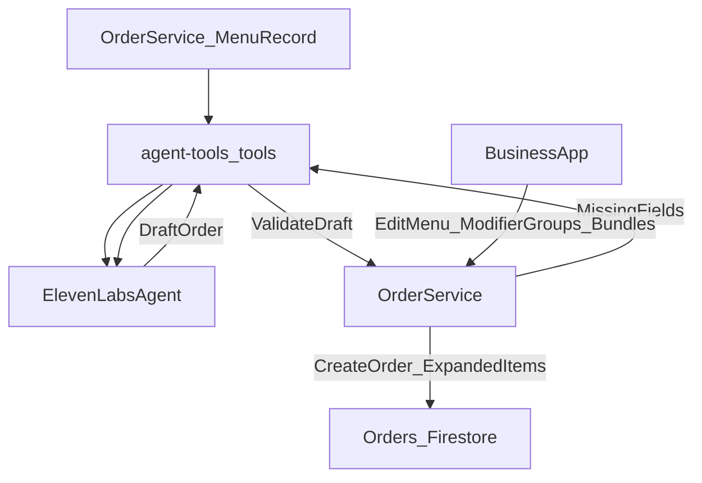

# Menu-only ordering guardrails (modifiers + bundles)

## Goals

- **No hallucinated products**: the agent can only propose and order items present in the store’s menu.
- **Required questions enforced**: if modifiers/bundle components are missing, the system returns structured “missing fields” so the agent asks targeted follow-ups.
- **Bundles as combo-builder**: for combos like “naan + drink + fries”, store orders as **expanded line items** grouped by a `bundleId`.

## Assumptions (per your answers)

- **No production users yet**: we can introduce breaking schema changes without backward-compat constraints.\n
- **Migration required**: existing menu data (`modifiers[]`, `sizes[]`) should be migrated into `modifierGroups` rather than forcing re-entry.\n
- **Rollout**: implement and test in **dev first**, then promote to staging/prod once validated.\n

## What the codebase currently supports (key findings)

- `order-service` menu schema is **flat**: `menuItem` has `modifiers: []{name,priceCents}` only—no groups, no requiredness, no bundles.
- `menu-ingestion` maps `sizes[]` into `modifiers[]` with `priceCents=0` (so modifiers exist but are not structured).
- Business app `MenuEditor` edits the same flat `modifiers[]` list.
- Validation in `order-service` ensures selected modifiers exist, but **does not enforce required selections**.

Files:

- Menu ingestion → order-service mapping: [backend/services/menu-ingestion/src/services/order-service-sync.ts](backend/services/menu-ingestion/src/services/order-service-sync.ts)
- Order-service menu schema + validation: [backend/services/order-service/cmd/order-service/main.go](backend/services/order-service/cmd/order-service/main.go)
- Business app menu editor: [apps/business/lib/features/menu/menu_editor.dart](apps/business/lib/features/menu/menu_editor.dart)

## Proposed architecture

## Data model upgrades

### 1) Menu: modifier groups (production-grade)

Upgrade `menuItem` to support **structured modifier groups** while keeping old `modifiers[]` for backward compatibility:

- `modifierGroups[]`:
  - `id`, `name`
  - `required` (bool)
  - `minSelections`, `maxSelections`
  - `options[]` (each: `id`, `name`, `priceCents`)

Migration rule:

- If `modifierGroups` is empty but `modifiers[]` exists, treat it as one optional group.

Migration implementation (dev-first):

- On read (`GET /stores/{storeId}/menu` and `/menu/snapshot`), if an item has legacy `modifiers[]` but no `modifierGroups`, derive a single group:\n
  - `id`: `legacy_modifiers`\n
  - `name`: `Options`\n
  - `required=false`, `min=0`, `max=len(options)`\n
  - options from `modifiers[]`\n
- On write (`PUT /stores/{storeId}/menu` and ingestion sync), prefer writing `modifierGroups`.\n
- Run a one-time migration in dev/staging/prod that rewrites existing `menus/{storeId}` documents to include `modifierGroups` so downstream tools/UI always see structured groups.

### 2) Menu: bundle rules (combo builder)

Add `bundleRules[]` at the menu/store level:

- `bundleId`, `displayName`
- `triggerItemId` or `triggerCategory` (what the user orders)
- `components[]` (drink/side/etc): each defines allowed items (by `itemIds` and/or `category` filter) and required modifier groups (e.g., drink size)
- `promptHintsFr` (optional) to help the agent ask the right question

### 3) Order payload: expanded line items grouped by bundle

Extend `orderItem` with:

- `bundleId` (string, optional)
- `bundleRole` (`main|drink|side|extra`, optional)
- structured modifier selections:
  - `modifierSelections[]` with `{groupId, optionId, name, priceCents}` (keep old `modifiers[]` accepted as legacy)

## Enforcement points (critical)

### 1) Backend validation (hard guarantee)

Implement a `validateOrderDraft` path in `order-service`:

- Validates every requested item exists and is available
- Validates required modifier groups
- Validates bundle completeness when a bundle rule was used
- Returns a structured error:
  - `missingGroups[]` (with group name + options)
  - `missingBundleComponents[]` (drink/side with allowed choices)
  - `invalidItems[]` (with best matches)

### 2) Tool-driven agent flow (soft policy)

Expose tools via `agent-tools` so ElevenLabs does not rely on memory:

- `search_menu(query, storeId, menuVersion)`
- `get_item_details(itemId, storeId, menuVersion)`
- `validate_order_draft(draft, storeId, menuVersion)`

Then enforce the agent loop:

- Collect → Validate → Ask missing → Confirm → Create/Modify order.

## UI changes

### Business app

- Upgrade Menu Editor to edit:
  - modifier groups per item
  - bundle rules per store (combo builder)
- Upgrade Order parsing to support object-form modifiers (and bundle grouping) safely.

## Rollout strategy

- Phase 1: modifier groups + validateDraft + agent-tools validation tools (no bundles yet).
- Phase 2: bundle rules + expanded line item grouping.
- Phase 3: optional LLM-assisted “template suggestions” for modifier questions, but still strictly validated.

## Key files likely to change

- [backend/services/order-service/cmd/order-service/main.go](backend/services/order-service/cmd/order-service/main.go)
- [backend/services/agent-tools/cmd/agent-tools/main.go](backend/services/agent-tools/cmd/agent-tools/main.go)
- [apps/business/lib/features/menu/menu_editor.dart](apps/business/lib/features/menu/menu_editor.dart)
- [apps/business/lib/models/order.dart](apps/business/lib/models/order.dart)
- [backend/services/menu-ingestion/src/services/order-service-sync.ts](backend/services/menu-ingestion/src/services/order-service-sync.ts)