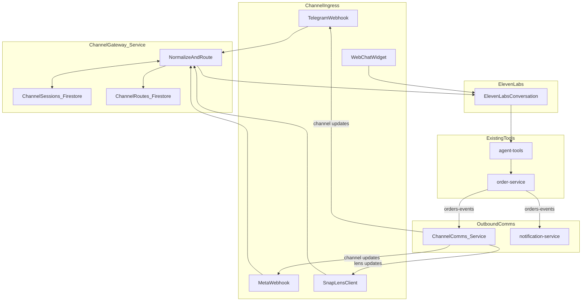

# Omni-channel Ordering Agent (ElevenLabs-powered)

## Goals

- Use **the existing ElevenLabs agent** as the brain for both voice + chat.
- Support **multi-channel inbound conversations** (Telegram, WhatsApp, Instagram, TikTok, Snapchat Lenses) with a **single backend integration surface**.
- Support **outbound comms**: order updates first, then compliant marketing/broadcast.
- Keep **store routing** compatible with per-store accounts, while allowing a fallback store-picker when routing is ambiguous.

## Key repo discovery (what we’ll reuse)

- ElevenLabs tool execution already routes through `agent-tools` (Go), e.g. `elevenlabs/tool_configs/order_create.json` -> `agent-tools`.
- Tenant/store context injection already exists via ElevenLabs conversation-init webhook: [`backend/services/agent-webhooks/cmd/agent-webhooks/main.go`](backend/services/agent-webhooks/cmd/agent-webhooks/main.go) reads Firestore `phone_number_routes` and returns `dynamic_variables`.
- Order updates currently go through SMS/call in `notification-service`: [`backend/services/notification-service/src/index.ts`](backend/services/notification-service/src/index.ts).

## Architecture (inbound + outbound)

### Core concepts

- **ChannelGateway**: one service that receives webhooks/events from channels, resolves store context, maintains session mapping, and forwards turns to ElevenLabs.
- **ChannelRoutes**: Firestore mappings from a channel account identity (per-store bot/number/page/lens) to `tenantId/storeId/businessType/agentId`.
- **ChannelSessions**: Firestore mapping from a user/thread on a channel to an ElevenLabs conversation id and the selected store (if the user picked one).
- **ChannelComms**: a new outbound comms service that consumes `orders-events` and sends updates back to the channel contact that originated the order; later it will also send broadcast/marketing messages with opt-in controls.

## Data model (Firestore)

- `channel_routes/{channel}_{accountId}`
- `channel` (telegram|whatsapp|instagram|tiktok|snap_lens)
- `account_id` (bot id / phone number id / page id / lens id)
- `tenant_id`, `store_id`, `business_type`
- `elevenlabs_agent_id` (optional override)
- `enabled`, `updated_at`, `created_at`
- `channel_sessions/{channel}_{accountId}_{userId}`
- `elevenlabs_conversation_id`
- `tenant_id`, `store_id` (may be empty until store selected)
- `last_seen_at`
- optional `thread_id`, `locale`
- **Order contact metadata**
- Extend `order-service`’s `orderRecord` to include a `channelContact` object (so outbound updates can go back to the right place) rather than overloading `callerId`.

## Channel specifics (how we’ll implement)

- **Telegram** (Phase 1): Full native bot integration via Bot API webhooks.
- **WhatsApp** (Phase 2): Prefer ElevenLabs’ native WhatsApp integration (as you noted) for inbound; still store contact metadata for outbound updates.
- **Instagram** (Phase 2): Via Meta webhooks + Graph API messaging (requires Meta app + permissions).
- **TikTok** (Phase 4): Start hybrid (deep-link to web chat) until messaging API access is confirmed; add native adapter once available.
- **Snapchat Lenses** (Phase 3): Build a small Lens-to-backend protocol:
- **In-lens ordering UI** (your “B”): lens sends structured cart actions to backend; backend validates against menu snapshot; backend can also feed these actions into the agent as context.
- **In-lens voice** (your “C”): lens provides transcript (or audio if feasible) -> backend forwards to ElevenLabs -> returns text + optional audio URL for TTS playback.
- Store context: support **QR/link parameters** plus **manual store pick** inside lens (your “A + C”).

## Security / compliance (enterprise-ready)

- Webhook verification per provider (Telegram secret token, Meta verify + HMAC, Snap request signing if used).
- Secrets in **GCP Secret Manager**; store only secret references in Firestore.
- Opt-in/consent tracking per channel (required for WhatsApp marketing especially).
- Idempotency + replay protection for inbound webhooks.
- Audit logging for inbound/outbound messages (store minimal PII; hash where possible).

## Implementation steps (phased)

### Phase 0 — Foundation

- Create shared Go package `backend/libs/agent-context/` extracted from `agent-webhooks`:
- route lookup (existing `phone_number_routes` + new `channel_routes`)
- dynamic variables builder (ETA + customer identity) for reuse.
- Update `agent-webhooks` to call the shared package (no behavior change).

### Phase 1 — Telegram inbound (MVP)

- Add `backend/services/channel-gateway/` (Go) with:
- `/telegram/webhook` receiver
- session + route resolution
- ElevenLabs conversation send/receive
- response dispatch back to Telegram

### Phase 2 — WhatsApp + Instagram

- WhatsApp: wire ElevenLabs native integration + ensure conversation-init routing works with store mapping.
- Instagram: add Meta webhook adapter in `channel-gateway`.

### Phase 3 — Snapchat Lenses

- Add `/snap/lens/*` endpoints to `channel-gateway` (or a small `lens-gateway` service if we want stricter isolation).
- Define a stable JSON protocol: session start, store select, cart updates, voice turns.
- Provide Lens integration docs and a minimal example script.

### Phase 4 — TikTok

- Implement hybrid deep-linking to web chat; add native messaging adapter only after access is confirmed.

### Phase 5 — Outbound updates + marketing

- Add `backend/services/channel-comms/` (Node/TS) subscribing to `orders-events`:
- send order status/ETA updates back to channel contacts
- later: broadcast campaigns with opt-in, rate limits, templates.

## Files we’ll change / add (high-level)

- Refactor + reuse:
- [`backend/services/agent-webhooks/cmd/agent-webhooks/main.go`](backend/services/agent-webhooks/cmd/agent-webhooks/main.go)
- Add shared lib:
- `backend/libs/agent-context/…`
- Add new services:
- `backend/services/channel-gateway/…`
- `backend/services/channel-comms/…`
- Extend order schema:
- [`backend/services/order-service/cmd/order-service/main.go`](backend/services/order-service/cmd/order-service/main.go)