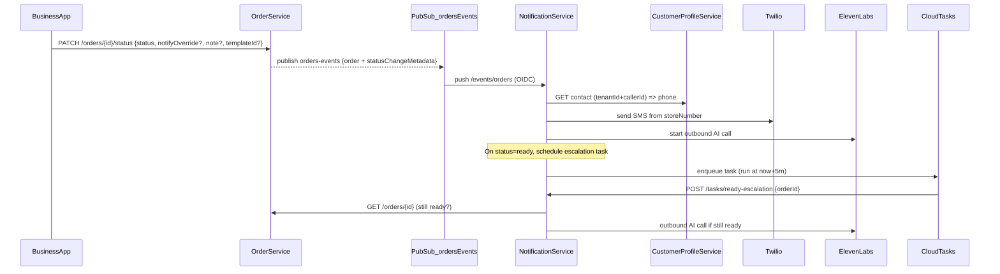

# Order status actions and customer comms

## Goals

- When an order status changes (`pending`, `confirmed`, `ready`, `completed`, `cancelled`), automatically notify the customer via **SMS or AI outbound call** based on **store settings**, with optional per-action notes.
- Allow the business app to pick “Ready (SMS)” vs “Ready (Call)” and add a note (with template suggestions) while still supporting **auto-by-default** behavior.
- Support “Ready + N minutes → outbound AI call” escalation using **Cloud Tasks**, configurable per store (opt-in/out).
- Keep customer contact lookup **Option B**: use `customer-profile-service` as the contact source.

## What already exists (repo analysis)

- **Order statuses and transitions** are already defined in `order-service`:
  - `pending → confirmed/ cancelled`
  - `confirmed → ready/ cancelled`
  - `ready → completed/ cancelled`

- `order-service` already publishes `orders-events` on create and status updates (full order payload).
- `notification-service` already has a Pub/Sub push endpoint `POST /events/orders` and is already wired via Terraform subscription with DLQ:
  - [`infrastructure/terraform/environments/dev/orders_events.tf`](infrastructure/terraform/environments/dev/orders_events.tf)
  - Equivalent in staging/prod.
- `notification-service` already has Twilio SMS support (`twilioClient.messages.create`) and persists alerts for the admin app.
- Business app already has status action buttons (confirmed/ready/completed/cancelled) in:
  - [`apps/business/lib/features/orders/order_list_screen.dart`](apps/business/lib/features/orders/order_list_screen.dart)
  - [`apps/business/lib/features/orders/order_detail_screen.dart`](apps/business/lib/features/orders/order_detail_screen.dart)

but currently they only call `setStatus(orderId, status)` (no channel/note).

- Store onboarding writes `stores/{storeId}` including `twilio_number` (we’ll use this as the **from** number).

## Proposed architecture

## Data model changes

- **Store settings** (Firestore `stores/{storeId}`) add an `order_comms` object:
  - per status: default channel (`sms|call|none`), default template id, templates list
  - ready escalation (store-controlled): `ready_escalation_enabled` (default false), `ready_escalation_minutes` (default 5) and `ready_escalation_channel` (`call`)

- **Order record** add optional `statusChange` metadata:
  - `previousStatus`, `newStatus`, `changedAt`, `changedBy` (business user id),
  - `notifyMode` (`auto|sms|call|none`), `note`, `templateId`.

## Service changes

### `order-service`

- Extend `PATCH /orders/{orderID}/status` payload to accept optional fields:
  - `notifyMode` (`auto|sms|call|none`)
  - `note` (string)
  - `templateId` (string)
- Include `previousStatus` and the above metadata in the published orders-events payload so notification-service can act deterministically.
- Add a customer modification endpoint (for your “call agent to modify while not cooking”):
  - `PATCH /orders/{orderID}` (allowed only when status is `pending` or `confirmed`) to update items/notes.
  - (Optional) helper query endpoint for the agent to find the active order for a caller: `GET /stores/{storeId}/orders/active?tenantId&callerId`.

### `customer-profile-service`

- Store and return a **preferred contact phone** (`preferredPhoneE164`) for `tenantId+callerId`.
- Add a lightweight internal endpoint for comms lookups (so notification-service doesn’t need raw callerId logic):
  - `GET /v1/customers/contact?tenantId=...&callerId=...` → `{phoneE164, customerName}`.

### `notification-service`

- Extend `/events/orders` to:
  - verify Pub/Sub push (OIDC token) to prevent abuse
  - parse status-change metadata
  - resolve store settings (`stores/{storeId}`)
  - resolve customer phone via `customer-profile-service` (Option B)
  - send SMS via Twilio using **store’s number** as `from`
  - start outbound AI calls via **ElevenLabs ConvAI API** (your chosen method)
  - schedule a Cloud Tasks “ready escalation” task when status becomes `ready` and store settings enable it (`ready_escalation_enabled=true`)
- Add `POST /tasks/ready-escalation` for Cloud Tasks.

### `onboarding`

- Update ElevenLabs phone number import config to enable outbound calling if required by their integration (currently `supports_outbound: false`).

## Business app changes (Flutter)

- Replace the direct status buttons with an **action sheet** per status:
  - Choose channel: SMS or Call (default preselected from store settings)
  - Choose template note (dropdown), editable text area
  - Submit -> calls the updated status endpoint with `{status, notifyMode, note, templateId}`
- Add a simple Store Settings screen to configure per-status defaults and templates.
- In Store Settings, add a toggle for ready escalation (enable/disable) and its delay minutes.

## Infrastructure (Terraform)

- Add Cloud Tasks queue (per environment) for `ready-escalation`.
- Allow `notification-service` to enqueue tasks and receive task callbacks.
- Add env vars:
  - `CUSTOMER_PROFILE_SERVICE_URL`
  - `ELEVENLABS_API_KEY` (via Secret Manager)
- Ensure Pub/Sub push to `notification-service /events/orders` uses OIDC audience and notification-service verifies it.

## Rollout

- Phase 1: SMS only + store templates + business app action sheet.
- Phase 2: AI outbound calls + ready escalation via Cloud Tasks.
- Phase 3: Customer “modify order” tool flow via voice agent.